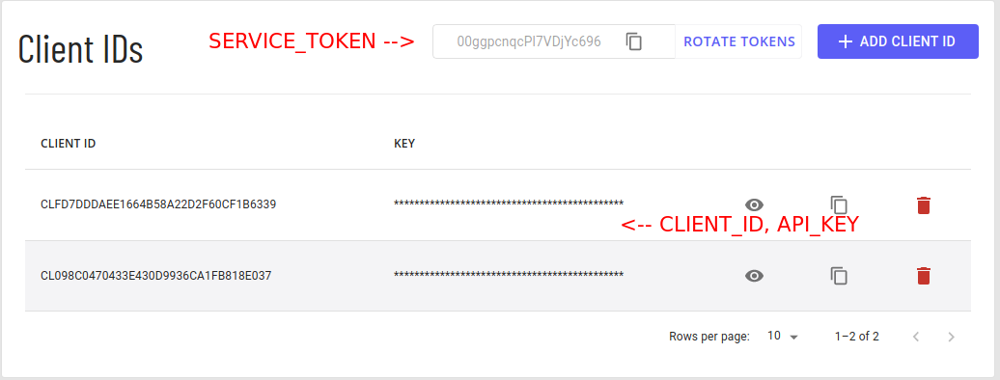

# grapheene-node

A Grapheene SDK for NodeJS

For documentation on the SDK please visie [docs.grapheene.com](https://docs.grapheene.com)

## What is Grapheene?

Using Grapheene and a few lines of code you can protect your application data with modern encryption, whether *in-transit* or  *at-rest* , on the server side or end-to-end between client devices.
This can be useful to comply with user privacy laws like GDPR and CCPA or to prevent data leak in case of an attacker gaining access to your systems or backup files.

It’s an *SDK* for your application augmented with cryptographic *cloud* services. With a few lines of code, you can encrypt and decrypt any type of data – like a message or a post, an image, the content of a form field, PII or personal health information.

Using Keyring Members, you can easily manage who – or what object in your code – can access the data, easily and programmatically. This is great for code reviews where you can clearly see the entity trying to decrypt data.

The Grapheene architecture is designed to leverage your local runtime to perform certain tasks and assist them from the cloud.

The goal is to keep your data secure even if there is an unwanted leak from your systems or from the Grapheene cloud. This is the power of a well designed encryption system.

## Getting Started

Getting started with Grapheene is quick and easy! In just a few steps you can protect your application with Grapheene's industry leading Zero Knoweldge authentication  and AES256 encryption.

### References

Grapheene Dashboard [https://dashboard.grapheene.com/](https://dashboard.grapheene.com/)

Grapheene API and SDK documentation [https://docs.grapheene.com/](https://docs.grapheene.com/)

NodeJS [https://nodejs.dev/learn/how-to-install-nodejs](https://nodejs.dev/learn/how-to-install-nodejs)

### Prerequisite

1. NodeJS v15 or higher is required for Grapheene SDK, find the installation instrucitons for your systems lates LTS [here](https://nodejs.dev/learn/how-to-install-nodejs)
2. An account with [Grapheene](https://dashboard.grapheene.com/login), a free account will work

### Installation

```
npm i @grapheene/grapheene
```

### Configuration

The Grapheene SDK requires a thre part credential system to get started.

* CLIENT_ID: This ID is a service level credential.
* API_KEY: This Key is a service level credential.
* SERVICE_TOKEN: This Token is an account level credential.

Your Client ID and API Key pair is a service level credential and a new pair should be used with each service you create.

The Service Token is an account level credential, if necessary this credential can be rotated if you believe it has been compromised.

All credentials are accessible from the [Grapheene Dashboard](https://dashboard.grapheene.com)


